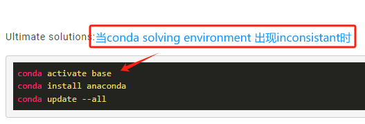
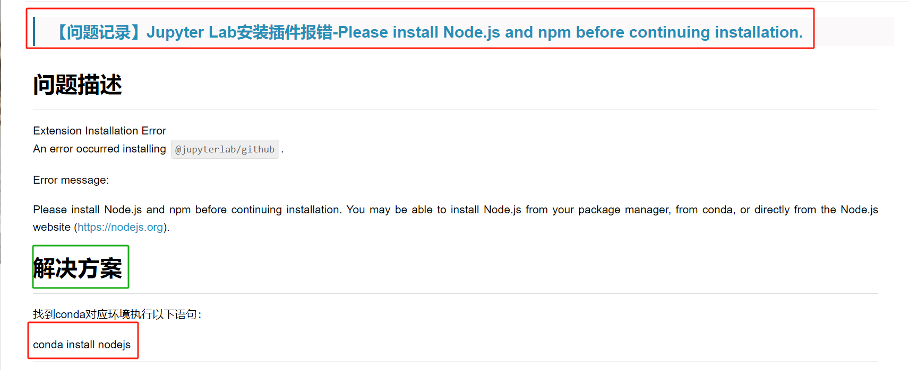

# GEE中文教程 By 吴秋生

## 1、geemap







***问题：***加载geemap时出现”Error displaying widget: model not found“

***解决方法：***

```shell
conda activate env # 进入目标虚拟环境
jupyter labextension install @jupyter-widgets/jupyterlab-manager jupyter-leaflet #重新安装jupyterlab manager和leaflet插件
```